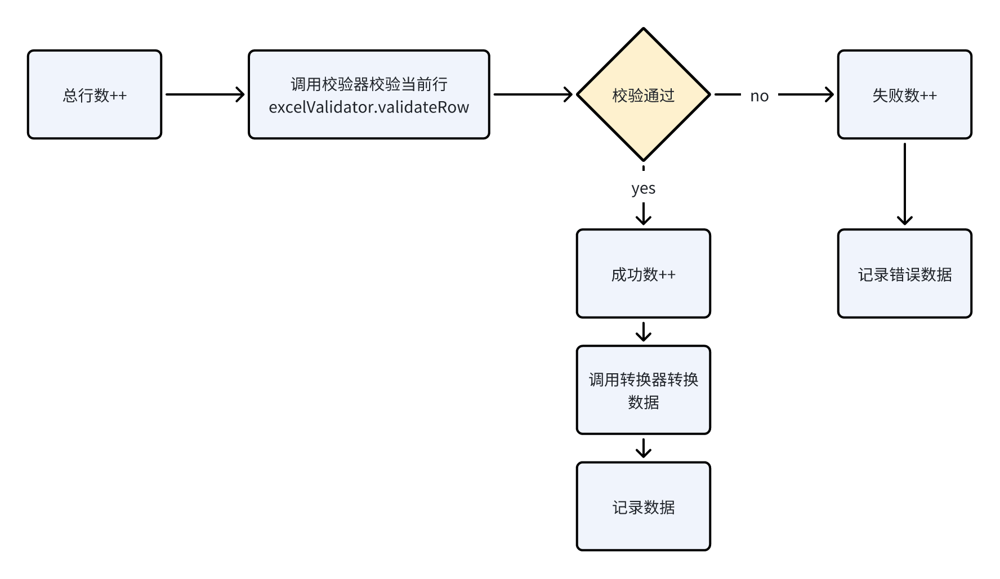

Markdown Preview
基于Alibaba EasyExcel的封装通用Excel处理工具类

## 功能特点

### 读取功能

1. **大文件处理**：支持读取分批处理，自定义批处理逻辑

2. **多sheet支持**：能够读取Excel文件中的多个sheet

3. **灵活参数**：支持指定sheet、指定表头行、批处理大小 参数

4. **数据校验**：

    * 基础校验：空行跳过、最大行数限制，必填项校验

    * 自定义校验：支持自定义行校验规则

5. **数据转换**：支持自定义数据转换功能

### 写入功能

* **多sheet支持**：能够写入多个sheet到一个Excel文件

* **灵活输出**：支持写入到File或HttpServletResponse

## 文件结构及主要逻辑

### 1.异常封装 exception

1.读异常ExcelReadException

2.写异常ExcelWriteException

3.校验异常ExcelValidationException

### 2.数据转换 converter

1.自定义数据转换器DataConverter接口

默认数据转换器DefaultDataConverter->返回原始数据

### 3.数据校验 validator

#### 1.校验器接口：ExcelValidator

默认校验器：DefaultExcelValidator

#### 2.校验规则rule：

1.空行校验EmptyRowRule

2.最大行数校验MaxRowNumRule

3.重复行校验DupicateRowRule:

4.必填列（空）校验RequiredFieldRule

#### 3.自定义行校验规则：实现ValidationRule接口

```plain&#x20;text
/**
 * 行校验
 * @param rowData
 * @param rowNum
 * @return
 */
ValidationResult validateRow(Map<Integer, Object> rowData, int rowNum) throws ExcelValidationException;
```

#### 4.校验结果result：

ValidationResult 校验结果

ValidationError 校验错误封装

### 4.读取 reader

#### 1.读取参数readParam

| 参数名              | 描述         | 类型                    | 默认值  |
| ---------------- | ---------- | --------------------- | ---- |
| sheetNo          | *sheet编号*  | Integer               |      |
| headRowNumber    | *表头行数*     | int                   |      |
| *customRules*    | *自定义校验规则*  | List\<ValidationRule> |      |
| batchSize        | *批次大小*     |                       | 1000 |
| maxRowNum        | *最大行数限制*   | int                   | 100  |
| *isSkipEmptyRow* | *是否开启空行校验* | boolean               | true |

#### 2.监听器GenericExcelReadListener

##### 成员变量：

| 参数名                | 描述          | 类型                                      | 默认值  |
| ------------------ | ----------- | --------------------------------------- | ---- |
| readParams         | *读取参数*      | ReadParams                              |      |
| excelValidator     | *校验器*       | ExcelValidator                          |      |
| converter          | *自定义转换器*    | DataConverter\<Map\<Integer,Object>, T> |      |
| batchDataProcessor | *自定义批处理器*   | BatchDataProcessor\<T>                  |      |
| cacheBatchData     | *缓存当前批次*    | List\<Map\<Integer, Object>>            |      |
| batchSize          | *批次大小*      | int                                     | 1000 |
| readResult         | *读取结果*      | ReadResult\<T>                          |      |
| currentSheetData   | *当前sheet数据* | SheetData\<T>                           |      |
| currentRowNum      | *当前行号*      | int                                     | 0    |

##### 监听器处理流程

##### 行处理方法流程：

### 5.写入 writer

#### 1.写入参数WriteParams

#### 2.写入接口ExcelCommonWriter

*方法1：写入到HttpServletResponse(多sheet)*

*方法2：写入到File(多sheet)*

分sheet写入writeSheetData

### 6.入口 EasyExcelCommonUtil

方法1：*读取原始数据*

方法2：*读取并自定义转换*

方法3：*写入到response(多sheet)*

方法4：*写入到file(多sheet)*

## 基本用法

#### 读取Excel文件

```java
ReadParams readParam = ReadParams.builder()
        .headRowNumber(1)
        .sheetNo(0)
        .batchSize(100)
        .maxRowNum(100)
        .build();

ReadResult<Map<Integer, Object>> mapReadResult =
        EasyExcelCommonUtil.readWithConverter(
                excelFile,
                new DefaultDataConverter(),
                readParam,
                new DefaultBatchDataProcessor<>());

Map<Integer, SheetData<Map<Integer, Object>>> sheetDataMap = mapReadResult.getSheetDataMap();

//第0个sheet的数据
SheetData<Map<Integer, Object>> sheetData = sheetDataMap.get(0);
```
